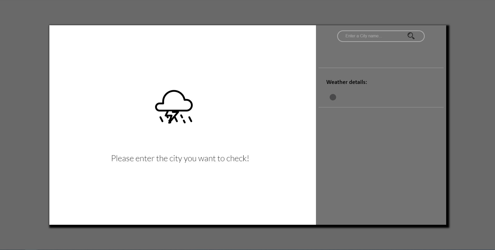
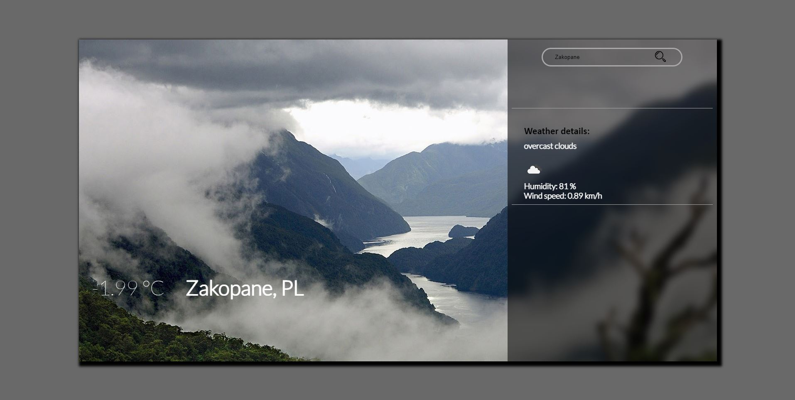

# Weather-App
A simple weather app which was built using html,css and javascript. 
It allows you to check the weather by entering the name of the city(wind speed, humidity, temperature, short description). 
For that projekt I used API from https://openweathermap.org/  

Gallery: 
 
 
